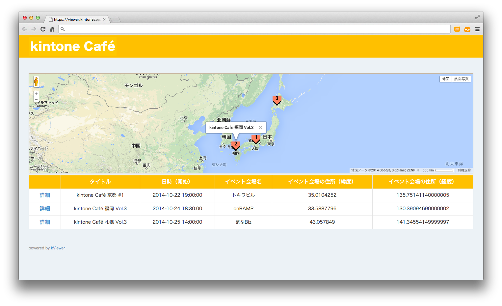

# Google Maps APIによる地図表示カスタマイズ

　別レポジトリで公開している[「**kintone Café イベントアプリ**」](https://github.com/yamaryu0508/kintone-JS/tree/master/doorkeeper)（kintoneアプリ）からデータ連携・公開しているkViewerの画面をGoogle Maps APIを用いて地図表示するカスタマイズ例です。

## 画面例（一覧画面）

## インストール
JavaScriptファイルとCSSファイルをkViewerの設定画面からアップロードしてください。なお、本カスタマイズではDOMから値を取得しており、次の項目名が一覧画面のカスタマイズのために必要です。

| 項目名 | 概要 |
|:------------:|:------------:|
| タイトル | バルーンに表示 |
| イベント会場の住所（緯度） | 地図表示用 |
| イベント会場の住所（緯度） | 地図表示用 |

## ライセンス
MIT license