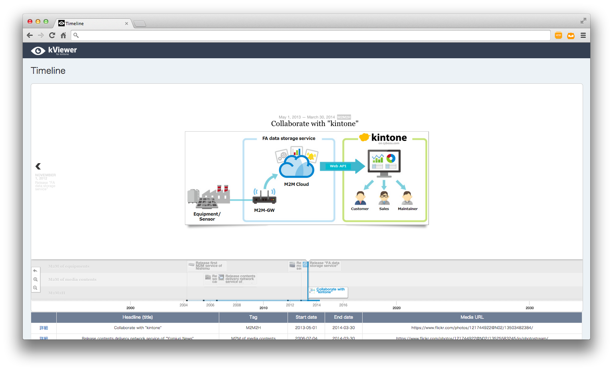

# TimelineJSを用いた年表表示カスタマイズ

　別レポジトリで公開している[「**Timeline**」](https://github.com/yamaryu0508/kintone-JS/tree/master/timeline)（kintoneアプリ）からデータ連携・公開しているkViewerの画面をkintoneアプリと同様にTimelineJSを用いて年表表示するカスタマイズ例です。

## 画面例

## インストール
JavaScriptファイルをkViewerの設定画面からアップロードしてください。

## ライセンス
MIT license